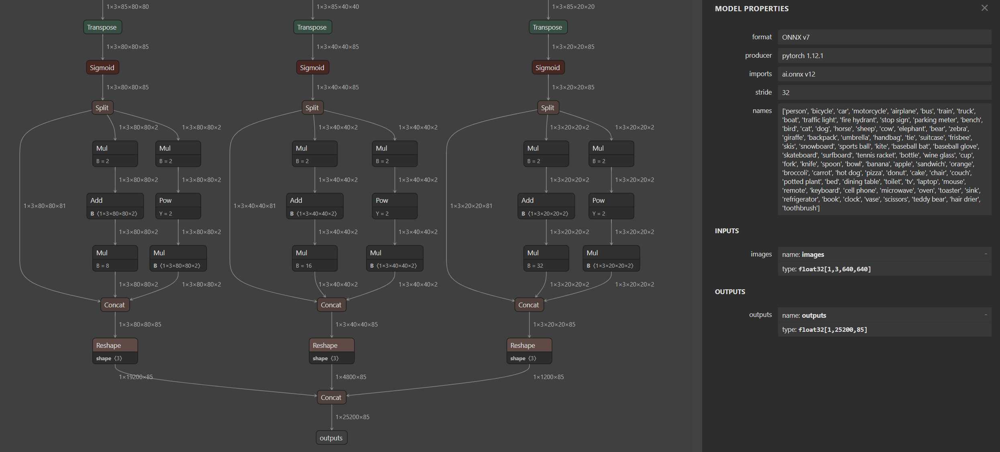
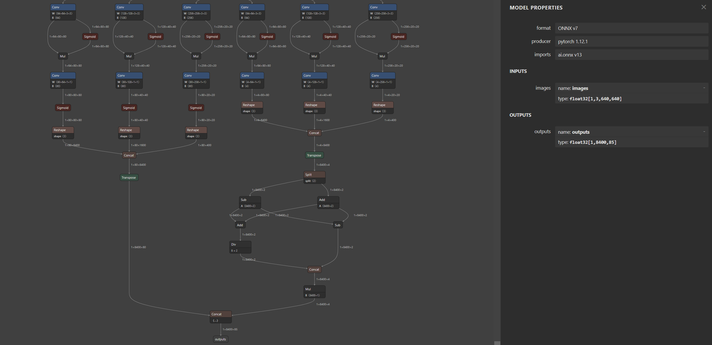
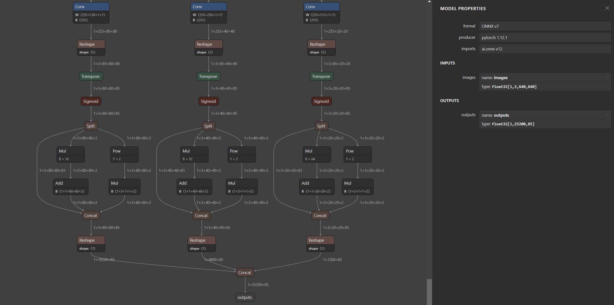
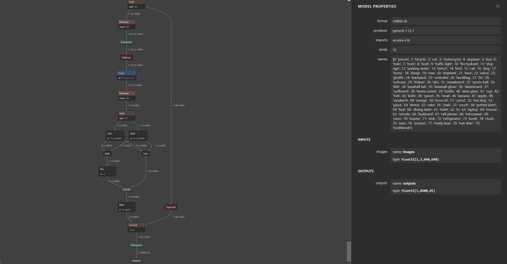
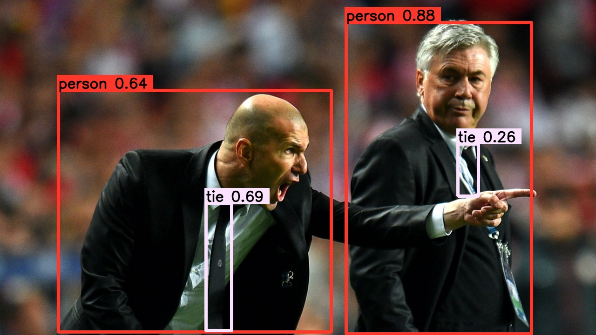

# YOLO_TRT_SIM

 一套代码同时支持 X,V5,V6,V7,V8, EdgeYOLO TRT推理 ™️，前后处理均由CUDA核函数实现 :rocket:

 该REPO功能描述：
 - 支持onnx转TRT FP32 FP16 INT8 engine;
 - 支持动态batch 推理；
 - 支持image和video 推理；
 - 支持多路多线程并行推理；
 - 仅依赖opencv和tensorrt;
 - 支持YOLO X V5 V6 V7 V8 EdgeYOLO 推理；
 - TRT模型加速，友好的封装格式，便于学习

### MY ENVIRONMENT

- cuda 11.7
- cudnn 8.4
- opencv 4.6
- tensorrt 8.4

### ONNX
pipeline: pt-->onnx-->engine

YOLOV5 onnx:

```
https://github.com/ultralytics/yolov5
python export.py --weights weights/yolov5s.pt --simplify
```


YOLOV6 onnx:
```
https://github.com/meituan/YOLOv6
python deploy/ONNX/export_onnx.py --weights weights/yolov6s.pt --simplify
```


YOLOV7 onnx:
```
https://github.com/WongKinYiu/yolov7
python export.py --weights weights/yolov7s.pt --grid --simplify 
```


YOLOV8 onnx:
```
pip install ultralytics

modules.py
410行改成：
# 1 84 8400 --> 1 85 8400
y = torch.cat((dbox, torch.ones(1, 1, 8400), cls.sigmoid()), 1)
# 1 85 8400 --> 1 8400 85
y = torch.transpose(y, 2, 1)

exporter.py
283行改成：
output_names = ['output0', 'output1'] if isinstance(self.model, SegmentationModel) else ['outputs']

export.py:
from ultralytics import YOLO
model = YOLO("weights/yolov8s.pt") 
success = model.export(mode='export',format="onnx", opset=16, simplify=True) 

python export.py
```



EdgeYOLO:
```


```


### Engine
onnx 生成 engine 有两种常用方案：

其一：command
```
trtexec --onnx=xxx.onnx --saveEngine=xxx.engine --fp32
trtexec --onnx=xxx.onnx --saveEngine=xxx.engine --fp16
```
其二：本PROJECT

利用YOLO::compile 参数 mode 更改 FP32 FP16 int8, 具体看complie函数; int8 量化需要准备矫正数据集即可。

## 思考
YOLO 目标检测速度和精度兼具，成为业界很多检测项目首选算法，因此一套高效的部署方案对于项目快速落地迭代至关必要。基于N卡的加速方案，最优的选择还是利用Nvidia TensorRT库对深度模型进行加速部署，另外利用CU核函数实现模型前后处理，模型整体速度会快速提升到一个理想的指标。

popular lib: 

[TensorRT](https://github.com/NVIDIA/TensorRT)

[onnx-tensorrt](https://github.com/onnx/onnx-tensorrt)

[tensorrtx](https://github.com/wang-xinyu/tensorrtx)

[tensorRT_Pro](https://github.com/shouxieai/tensorRT_Pro)

[tensorrtCV](https://github.com/wdhao/tensorrtCV)

以上库可以进行认真学习，领悟。



REPO参考：[https://github.com/shouxieai/tensorRT_Pro](https://github.com/shouxieai/tensorRT_Pro)

DULAO YYDS :heartpulse: 